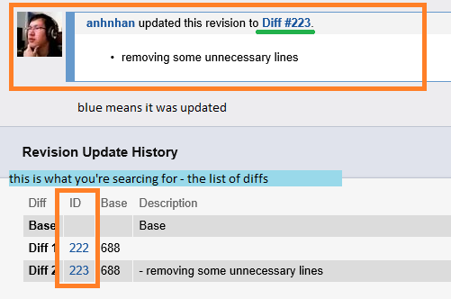
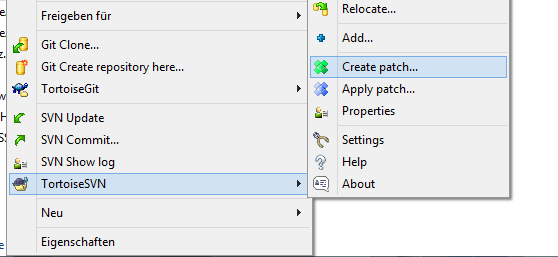

NOTE: The commands explained here are run from the command line, like `cmd` or `Git Bash`.

Method 1: arc patch
===================

NOTE: This method seems to be prone to errors, or at least it did not give me any good results in combination with SVN. Ok, it never worked for me when using SVN.

Run a command like this:

```
arc patch D123
```

This is supposed to incorporate the latest changes from that _Differential_ revision into your working copy.

Alternatively, if you need other sources for the patch, you can instead run one of the following commands:

When you want to retrieve a previous change from a revision, which has been updated or overwritten since, you will want to access that change with the diff. Go to the _Differential Revision_, go down to _Revision Update History_ and identify the diff id. Note it down, else you will easily forget it. Then run the following command (I assume you want diff id 218, which is attached to D102).

```
arc patch --diff 218
```

 

If you already have the patch file (on how to get one, see _Method 2_), you can run this:

```
arc patch --patch path/to/file.patch
```

Method 2: Applying per patch
============================

You should always keep this method in mind. It _will_ work. Your best fallback option, and probably your only one.

Retrieving the patch
--------------------

First, you can retrieve a patch file from a _Differential Revision_. Either you can retrieve directly the latest changes from a revision, or a specific change by speciyfing a diff (see _Method 1_).

For retrieving patch files, you can either choose the `unified` format or the `git` format. The `git` format is more detailed and contains more information, but not all programs may understand it. It that's the case, You should use the `unified` format. They are mostly the same though.

NOTE: Patches work only for text files, like `.xml` and `.lua`, but _not_ for binary files like images, models and textures are.

To get a patch for a revision (here `D123`) in the `git` format and save it in `revD123.patch`, use this:

```
arc export --revision D123 --git > revD123.patch
```

Now, only using `arc export --revision D123 --git` would be enough. But this will simply output the patch in the command line directly and is therefore unuseable. We want to save it in a file instead. The `> [filename]` tells the command line to "catch" the output and save in in a file.

The same command for a `unified` patch:

```
arc export --revision D123 --unified > revD123.patch
```

If you instead wanted to retrieve the change from a diff rather than the latest change from a revision, use this:

```
arc export --diff 218 --git > diff_id_218.patch
```

Applying the patch
------------------

You have three options here.

 1. Use `arc patch --patch path/to/file.patch` - see _Method 1_ - it will not work with SVN for some reason...
 2. Use `svn patch path/to/file.path` - it will not understand the `git` format
 3. Use TortoiseSVN to apply patches with super-high precision - you should love this method since it
    1. Understands the `git` format
    2. You can select which files to change and which not
    3. You can easily review the changes before applying them

 

Try it out, too!
================

There are already several _Differential Revisions_ on _Phabricator_ for code changes affecting the CaW code base. D53 (dummy template for T85, Upgradeable Ships), D102 (Removing unnecessary unit spawners) and D104 (Fixing T9) come to my mind, although there are a few more. Try it out, fetch the changes from _Phabricator_!
